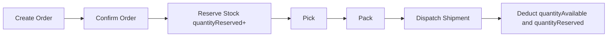
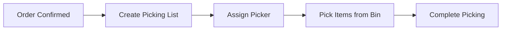
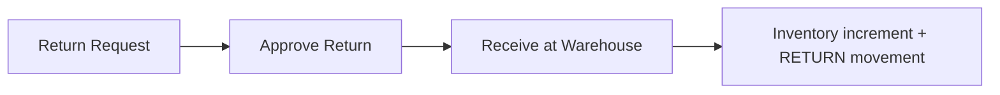
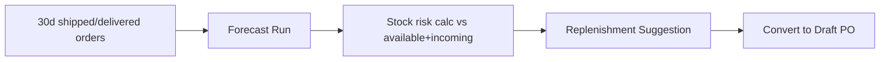
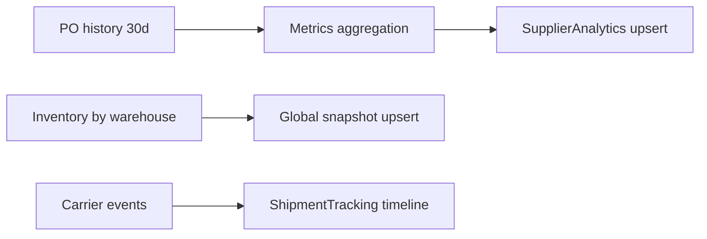
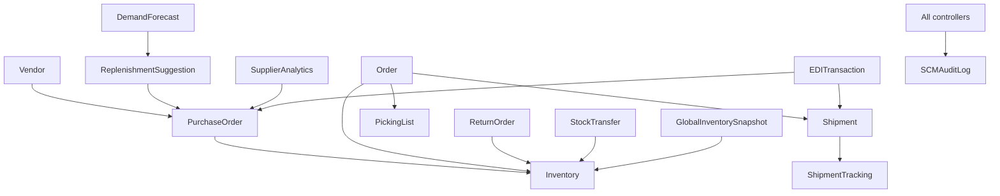

# SCM Backend System Documentation

Generated from source analysis on 2026-03-15.

## 1) SCM Architecture Overview

### Runtime Architecture

```mermaid
flowchart LR
  C[Client / Portal / Integrations] --> R[/api/scm/* Routes/]
  R --> M1[isAuthenticated]
  M1 --> M2[authenticateOrgToken]
  M2 --> CT[SCM Controllers]
  CT --> SV[SCM Services\n(EDI mapper/service)]
  CT --> DB[(MongoDB SCM Collections)]
  CT --> AL[(SCMAuditLog)]
```

### SCM Stack in This Repo
- Framework: Express + Mongoose
- Mount point: `/api/scm` (from `server.js`)
- Auth model: dual-cookie auth (`_fxl_9X8Y7Z` + `_fxl_1A2B3C`)
- Tenant model: `organizationId` scoping in controllers and schemas
- Transaction model: MongoDB session transactions for critical stock mutations
- Background jobs: no dedicated SCM cron/jobs folder; SCM compute is request-driven endpoints

## 2) SCM Modules Identified

Implemented modules:
- Vendor Management
- Purchase Orders (Procurement)
- Inventory Management
- Order Fulfillment
- Shipment Management
- Warehouse Picking
- Warehouse Location Management
- Returns Management
- Demand Forecasting
- Replenishment Suggestions
- Stock Transfers
- Supplier Analytics
- Shipment Tracking
- Global Inventory Aggregation
- EDI Integration
- Supplier Portal APIs
- SCM Audit Logging

Data-model-only (no SCM route/controller currently):
- Product Catalog core (`Category`, `Product`, `ProductVariant`, `SKU`)
- Warehouse master (`Warehouse`) model exists but no SCM CRUD endpoints in SCM routes

## 3) Controller -> Route -> Model/Service Map

### Procurement / Vendor
- Routes: `src/routes/SCM/vendor.routes.js`
- Controller: `src/controllers/SCM/vendor.controller.js`
- Models: `Vendor`, `AuditLog`

### Procurement / Purchase Orders
- Routes: `src/routes/SCM/purchaseOrder.routes.js`
- Controller: `src/controllers/SCM/purchaseOrder.controller.js`
- Models: `PurchaseOrder`, `Inventory`, `InventoryMovement`, `AuditLog`
- Notes: receipt uses DB transaction

### Inventory
- Routes: `src/routes/SCM/inventory.routes.js`
- Controller: `src/controllers/SCM/inventory.controller.js`
- Models: `Inventory`, `InventoryMovement`, `AuditLog`

### Orders / Fulfillment
- Routes: `src/routes/SCM/order.routes.js`
- Controller: `src/controllers/SCM/OrderController.js`
- Models: `Order`, `Inventory`, `AuditLog`
- Notes: confirmation/cancel use DB transactions for reservation consistency

### Shipments
- Routes: `src/routes/SCM/shipment.routes.js`
- Controller: `src/controllers/SCM/ShipmentController.js`
- Models: `Shipment`, `Order`, `Inventory`, `InventoryMovement`, `AuditLog`
- Notes: dispatch uses DB transaction for inventory deduction

### Warehouse Execution (Picking)
- Routes: `src/routes/SCM/pickingList.routes.js`
- Controller: `src/controllers/SCM/pickingList.controller.js`
- Models: `PickingList`, `Inventory`, `AuditLog`

### Warehouse Location
- Routes: `src/routes/SCM/warehouseLocation.routes.js`
- Controller: `src/controllers/SCM/warehouseLocation.controller.js`
- Models: `WarehouseLocation`

### Returns
- Routes: `src/routes/SCM/return.routes.js`
- Controller: `src/controllers/SCM/return.controller.js`
- Models: `ReturnOrder`, `Inventory`, `InventoryMovement`, `AuditLog`
- Notes: receive uses DB transaction

### Forecasting + Replenishment
- Routes: `src/routes/SCM/forecast.routes.js`, `src/routes/SCM/replenishment.routes.js`
- Controllers: `forecast.controller.js`, `replenishment.controller.js`
- Models: `DemandForecast`, `ReplenishmentSuggestion`, `Order`, `Inventory`, `PurchaseOrder`, `AuditLog`

### Stock Transfers
- Routes: `src/routes/SCM/stockTransfer.routes.js`
- Controller: `src/controllers/SCM/stockTransfer.controller.js`
- Models: `StockTransfer`, `Inventory`, `InventoryMovement`, `AuditLog`
- Notes: completion uses DB transaction

### Supplier Analytics
- Routes: `src/routes/SCM/supplierAnalytics.routes.js`
- Controller: `src/controllers/SCM/supplierAnalytics.controller.js`
- Models: `SupplierAnalytics`, `PurchaseOrder`, `AuditLog`

### Tracking
- Routes: `src/routes/SCM/tracking.routes.js`
- Controller: `src/controllers/SCM/tracking.controller.js`
- Models: `ShipmentTracking`, `Shipment`, `AuditLog`

### Global Inventory
- Routes: `src/routes/SCM/globalInventory.routes.js`
- Controller: `src/controllers/SCM/globalInventory.controller.js`
- Models: `Inventory`, `Warehouse`, `GlobalInventorySnapshot`, `AuditLog`

### EDI
- Routes: `src/routes/SCM/edi.routes.js`
- Controller: `src/controllers/SCM/edi.controller.js`
- Services: `src/service/SCM/edi.service.js`, `src/service/SCM/ediMapper.service.js`
- Models: `EDITransaction`, `PurchaseOrder`, `Shipment`, `AuditLog`

### Supplier Portal
- Routes: `src/routes/SCM/supplierPortal.routes.js`
- Controller: `src/controllers/SCM/supplierPortal.controller.js`
- Models: `PurchaseOrder`, `Shipment`, `AuditLog`

## 4) SCM Data Model + Index Summary

Core collections and notable indexes:
- `Inventory`: unique `(organizationId, skuId, warehouseId)`
- `PurchaseOrder`: unique `(organizationId, orderNumber)`
- `Order`: unique `(organizationId, orderNumber)`
- `DemandForecast`: unique `(organizationId, skuId, period)`
- `SupplierAnalytics`: unique `(organizationId, vendorId, period)`
- `GlobalInventorySnapshot`: unique `(organizationId, skuId)`
- `WarehouseLocation`: unique `(organizationId, warehouseId, locationCode)`
- `AuditLog`: indexed by org/entity/user/time

## 5) Operational / Business Flows

### Procurement Flow
```mermaid
flowchart LR
  V[Vendor] --> PR[Create Purchase Order]
  PR --> AP[Approve PO]
  AP --> GR[Receive PO]
  GR --> INV[Inventory + InventoryMovement(PURCHASE)]
```

### Order Fulfillment Flow


### Warehouse Execution Flow


### Returns Flow


### Planning Flow


### Analytics Flow


## 6) Request Lifecycle (Controller Flow)

Typical SCM request:
1. `Route (/api/scm/*)`
2. `isAuthenticated` middleware
3. `authenticateOrgToken()` middleware
4. Controller action (input/state checks)
5. Optional service (EDI mapping + EDI transaction creator)
6. Mongoose model operations (sometimes inside session transaction)
7. `AuditLog` write
8. `ApiResponse` success or `ApiError` -> global `errorHandler`

## 7) Multi-Tenant Architecture (`organizationId`)

### How tenancy is applied
- Every SCM schema has `organizationId` field (required + indexed).
- Every SCM route requires org token middleware.
- Controllers derive org using `req.orgUser?.orgId`.
- Query/read/update/delete operations are scoped with `{ organizationId, ... }`.
- Aggregations use `$match` with `organizationId` ObjectId.

### Verification result
- SCM controllers consistently enforce org filtering for reads/writes.
- DB-level unique indexes are scoped by `organizationId` for key business identifiers.

## 8) Inventory Architecture

### Components
- Snapshot records: `Inventory` (available/reserved per SKU/warehouse)
- Movement log: `InventoryMovement` (PURCHASE, SALE, TRANSFER_IN/OUT, RETURN, ADJUSTMENT)
- Global snapshot: `GlobalInventorySnapshot` (cross-warehouse rollup)

### Reservation and deduction logic
- Order confirm: checks `quantityAvailable - quantityReserved >= required`; then increments `quantityReserved`.
- Shipment dispatch: decrements both `quantityAvailable` and `quantityReserved`.
- Cancel confirmed order: decrements `quantityReserved` to release stock.

### Overselling prevention
- Business checks are implemented before reserve/deduct.
- Critical paths use MongoDB transactions (`confirmOrder`, `dispatchShipment`, `receivePurchaseOrder`, `receiveReturn`, `completeStockTransfer`, `cancelOrder`).

## 9) Analytics and Background Processing

### Analytics implemented
- Supplier performance scoring (`runSupplierAnalytics`)
- Demand forecasting + replenishment suggestion (`runForecast`)
- Global inventory aggregation (`getGlobalInventory`, `getGlobalInventoryBySku`)
- Shipment tracking event timeline (`trackingWebhook`)

### Job architecture status
- No dedicated SCM cron/job pipeline found in `src/jobs` or root `jobs`.
- Analytics are currently on-demand API-triggered, not scheduled.

## 10) Integration Layer

### EDI
- Outbound: `/edi/send` supports 850 (PO) and 856 (Shipment) mapping.
- Inbound: `/edi/receive` accepts EDI doc + payload, stores normalized transaction.
- Persistence: `EDITransaction` with `direction`, `documentType`, status.

### Supplier portal
- Supplier-scoped PO listing and confirmation.
- Supplier-initiated shipment creation.

### Carrier webhooks
- `/tracking/webhook` stores tracking events and updates shipment status mapping.

## 11) API Documentation (All SCM Endpoints)

Base path: `/api/scm`

Common success envelope:
```json
{
  "success": true,
  "statusCode": 200,
  "message": "...",
  "data": {}
}
```

Common error envelope:
```json
{
  "success": false,
  "message": "...",
  "status": 400,
  "timestamp": "2026-03-15T00:00:00.000Z"
}
```

### Vendor
- `POST /vendors` create vendor. Body: `name` required; optional `vendorCode,email,phone,taxId,address,isActive`. Codes: `201,400,401`.
- `GET /vendors` list vendors. Query: `page,limit,isActive`. Codes: `200,401`.
- `GET /vendors/:id` get vendor by id. Codes: `200,400,401,404`.
- `PATCH /vendors/:id` update vendor. Codes: `200,400,401,404`.
- `DELETE /vendors/:id` delete vendor. Codes: `200,400,401,404`.

### Purchase Orders
- `POST /purchase-orders` create PO. Body: `vendorId,orderNumber,items[]` required; optional `warehouseId,expectedDeliveryDate,notes,currency`. Codes: `201,400,401`.
- `GET /purchase-orders` list POs. Query: `page,limit,status,vendorId,orderNumber`. Codes: `200,401`.
- `GET /purchase-orders/:id` get PO. Codes: `200,400,401,404`.
- `PATCH /purchase-orders/:id` update draft PO only. Codes: `200,400,401,404`.
- `POST /purchase-orders/:id/approve` draft -> approved. Codes: `200,400,401,404`.
- `POST /purchase-orders/:id/receive` approved -> received + inventory update. Body optional: `items[{skuId,receivedQuantity}], warehouseId`. Codes: `200,400,401,404`.

### Inventory
- `GET /inventory` list inventory. Query: `page,limit,skuId,warehouseId`. Codes: `200,401`.
- `GET /inventory/:skuId` list by sku. Codes: `200,400,401`.
- `POST /inventory/adjust` manual adjust. Body: `skuId,warehouseId,quantity` required; optional `warehouseLocationId,note`. Codes: `200,400,401`.

### Orders
- `POST /orders` create order. Body: `orderNumber,items[],warehouseId` required; optional `customerId,notes,currency`. Codes: `201,400,401`.
- `GET /orders` list orders. Query: `page,limit,status,orderNumber,customerId`. Codes: `200,401`.
- `GET /orders/:id` get order. Codes: `200,400,401,404`.
- `POST /orders/:id/confirm` reserve stock. Codes: `200,400,401,404`.
- `POST /orders/:id/pick` status confirmed -> picking. Codes: `200,400,401,404`.
- `POST /orders/:id/pack` status picking -> packed. Codes: `200,400,401,404`.
- `POST /orders/:id/cancel` created/confirmed -> cancelled. Codes: `200,400,401,404`.

### Shipments
- `POST /shipments` create shipment. Body: `orderId,warehouseId` required; optional `carrier,trackingNumber`. Codes: `201,400,401,404`.
- `POST /shipments/:id/dispatch` dispatch packed order + deduct stock. Codes: `200,400,401,404`.

### Warehouse Picking
- `POST /picking-lists` create picking list. Body: `orderId,warehouseId,items[]` required. Codes: `201,400,401`.
- `GET /picking-lists` list. Query: `page,limit,status,orderId,warehouseId`. Codes: `200,401`.
- `GET /picking-lists/:id` get by id. Codes: `200,400,401,404`.
- `POST /picking-lists/:id/assign` assign picker. Body: `pickerId`. Codes: `200,400,401,404`.
- `POST /picking-lists/:id/pick` pick item. Body: `skuId,quantity`. Codes: `200,400,401,404`.
- `POST /picking-lists/:id/complete` complete pick. Codes: `200,400,401,404`.

### Warehouse Locations
- `GET /warehouse-locations` list locations. Query: `warehouseId,page,limit`. Codes: `200,401`.
- `POST /warehouse-locations` create location. Body: `warehouseId` + (`locationCode` or `zone/rack/bin`), optional `capacity,description`. Codes: `201,400,401`.
- `PATCH /warehouse-locations/:id` update location. Codes: `200,400,401,404`.

### Returns
- `POST /returns` create return. Body: `orderId,items[],reason` required. Codes: `201,400,401`.
- `GET /returns` list returns. Query: `page,limit,status,orderId`. Codes: `200,401`.
- `POST /returns/:id/approve` requested -> approved. Codes: `200,400,401,404`.
- `POST /returns/:id/receive` approved -> received + restock. Body: `warehouseId`. Codes: `200,400,401,404`.

### Forecasting
- `POST /forecast/run` run 30-day forecast + replenishment generation. Codes: `200,401`.
- `GET /forecast` list forecasts. Query: `page,limit,period`. Codes: `200,401`.
- `GET /forecast/:skuId` get sku forecast. Codes: `200,400,401,404`.

### Replenishment
- `GET /replenishment` list suggestions. Query: `page,limit,status,skuId`. Codes: `200,401`.
- `POST /replenishment/:id/approve` convert suggestion to draft PO. Body: `vendorId,warehouseId`. Codes: `200,400,401,404`.
- `POST /replenishment/:id/reject` reject suggestion. Codes: `200,400,401,404`.

### Stock Transfers
- `POST /stock-transfers` create transfer. Body: `skuId,sourceWarehouseId,destinationWarehouseId,quantity`. Codes: `201,400,401`.
- `GET /stock-transfers` list transfers. Query: `page,limit,status,skuId`. Codes: `200,401`.
- `POST /stock-transfers/:id/approve` requested -> in_transit. Codes: `200,400,401,404`.
- `POST /stock-transfers/:id/complete` complete transfer and movements. Codes: `200,400,401,404`.

### Supplier Analytics
- `POST /supplier-analytics/run` recompute analytics. Codes: `200,401`.
- `GET /supplier-analytics` list analytics. Query: `page,limit,period`. Codes: `200,401`.
- `GET /supplier-analytics/:vendorId` fetch vendor analytics. Codes: `200,401,404`.

### Shipment Tracking
- `GET /tracking/:shipmentId` list tracking events. Codes: `200,400,401`.
- `POST /tracking/webhook` ingest tracking event. Body: `status` + (`shipmentId` or `trackingNumber`) required; optional `carrier,location,timestamp,metadata,documentType`. Codes: `200,400,401,404`.

### Global Inventory
- `GET /global-inventory` recompute and return all snapshots. Codes: `200,401`.
- `GET /global-inventory/:skuId` recompute and return sku snapshot. Codes: `200,400,401`.

### EDI
- `POST /edi/send` create outbound EDI transaction. Body: `documentType,referenceId,referenceType`, optional `payload`. Codes: `201,400,401,404`.
- `POST /edi/receive` create inbound EDI transaction. Body: `documentType,payload` required; optional `referenceId,referenceType`. Codes: `201,400,401`.
- `GET /edi` list transactions. Query: `page,limit,documentType,direction`. Codes: `200,401`.
- `GET /edi/:id` get transaction by id. Codes: `200,400,401,404`.

### Supplier Portal
- `GET /supplier/orders` list supplier-visible POs. Query: `vendorId` required; optional `page,limit,status`. Codes: `200,400,401`.
- `POST /supplier/orders/:id/confirm` supplier confirms PO. Body: `vendorId`. Codes: `200,400,401,404`.
- `POST /supplier/shipments` supplier creates shipment. Body: `orderId,vendorId,warehouseId` required; optional `carrier,trackingNumber`. Codes: `201,400,401,404`.

## 12) Module Dependencies



## 13) Missing Features / Improvement Recommendations

High-priority gaps:
- Route docs mismatch: existing older docs/postman reference `/api/v1/scm`, but runtime mount is `/api/scm`.
- Existing checked-in Postman file is invalid JSON.
- No SCM permission middleware usage (`checkPermission`) on routes; only auth + org context.
- No idempotency keys on write endpoints (`receive`, `dispatch`, webhook endpoints), risking duplicate external calls.
- Webhook endpoint requires auth cookies; external carriers typically cannot send cookie-authenticated calls.
- No optimistic locking/version field for high-contention inventory rows.
- Picking flow validates bin stock but does not decrement bin-level inventory at pick time.
- `rejectReplenishment` currently has no audit log write.

Data/validation risks:
- Limited payload schema validation in controllers (shape/range checks are minimal).
- `AuditLog.userId` is required at schema level; calls using nullable fallback can fail if token payload is incomplete.
- `trackingWebhook` accepts broad `metadata` payload without normalization/size constraints.

Scaling/operability risks:
- Analytics/forecast/global inventory are synchronous request-time compute (can be heavy under load).
- No SCM-specific async worker/queue for long-running aggregation.
- Sparse observability on business KPIs and transaction retry behavior.

## 14) Implementation Guide for New Engineers

1. Start at `server.js` to confirm route mount (`/api/scm`) and middleware chain.
2. Read SCM routes in `src/routes/SCM` to discover endpoint surface.
3. For each route, inspect corresponding controller in `src/controllers/SCM`.
4. Use model schemas in `src/models/SCM` to understand state machine fields and indexes.
5. Track stock-changing transaction paths first:
   - `OrderController.confirmOrder`
   - `ShipmentController.dispatchShipment`
   - `purchaseOrder.controller.receivePurchaseOrder`
   - `return.controller.receiveReturn`
   - `stockTransfer.controller.completeStockTransfer`
6. Review audit behavior (`AuditLog`) and event/action naming.
7. Review integration paths: `tracking.controller`, `edi.controller`, `supplierPortal.controller`.

## 15) Deployment and Scaling Considerations

- MongoDB: keep replica set enabled in production to support transactions.
- Connection pool: current `maxPoolSize: 10`; tune for traffic profile.
- Horizontal scale: ensure sticky/session strategy for cookie auth, or migrate to header token strategy for APIs/webhooks.
- Add background workers for:
  - forecast/supplier analytics/global inventory refresh
  - webhook retries and dead-letter handling
- Add index review cadence with real query stats.
- Add rate limits per high-write SCM endpoint.

## 16) System Diagram (End-to-End SCM)

```mermaid
flowchart LR
  SUP[Suppliers] --> PROC[Procurement\n(Vendors + POs)]
  PROC --> INV[Inventory]
  INV --> WH[Warehouse\n(Picking + Locations + Transfers)]
  WH --> ORD[Orders]
  ORD --> SHIP[Shipments + Tracking]
  SHIP --> DEL[Delivery]
  DEL --> RET[Returns]
  RET --> INV
  INV --> ANA[Forecast + Supplier Analytics + Global Snapshot]
  PROC --> EDI[EDI]
  SHIP --> EDI
```
